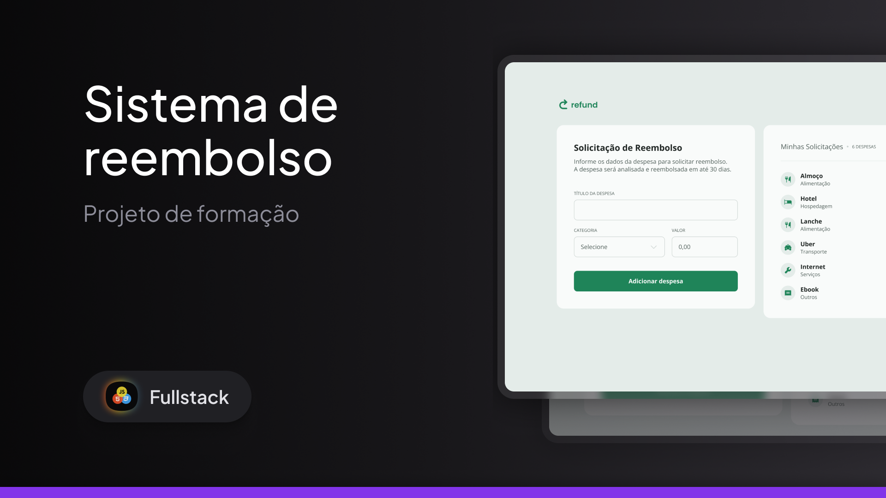

<h1 align="center">Refound</h1>

Refund is a web application for requesting reimbursement and listing expenses.

<a href="#-technology">Technologies</a>&nbsp;&nbsp;&nbsp;|&nbsp;&nbsp;&nbsp;
<a href="#-project">Project</a>&nbsp;&nbsp;&nbsp;|&nbsp;&nbsp;&nbsp; <a href="#memo-license">License</a>

 

## 🚀 Technologies

This project was developed with the following technologies:

- HTML
- CSS
- JavaScript

## Project
This is a simple, fully responsive and interactive project with a user-friendly design.